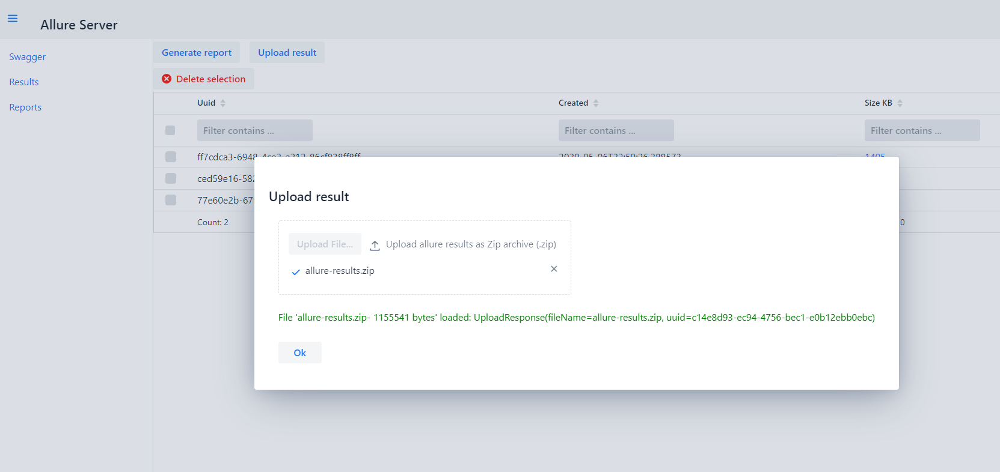

Allure Portal (Allure Report Server)
=================================
  

[](https://www.oracle.com/java/technologies/javase-jdk11-downloads.html)
[](https://gradle.org/)
[](https://github.com/junit-team/junit4/blob/master/doc/ReleaseNotes4.13.md)

[](https://github.com/checkstyle/checkstyle)
[](https://github.com/pmd/pmd)
[](https://github.com/spotbugs/spotbugs)

## About
Allure server for store / aggregate / manage Allure results and generate / manage Allure Reports.

There is simple API with Swagger(OpenAPI) Description.

Just use Spring Boot Jar from Release Page.
   
Web GUI has been available from Release v2.0.0 

Example on [allure.iopump.ru](http://allure.iopump.ru/) or [allure-server.herokuapp.com](https://allure-server.herokuapp.com/) _(unstable)_

## Get Started
### Docker
There is a docker image on Docker Hub: [allure-server](https://hub.docker.com/r/kochetkovma/allure-server)
Running as Docker container look at: [readme](https://hub.docker.com/r/kochetkovma/allure-server)
### Jar 
Get the latest release [Releases](https://github.com/kochetkov-ma/allure-server/releases)   
Download `allure-server.jar`  
Update your jre(jdk) up to [Java 11](https://www.oracle.com/java/technologies/javase/jdk11-archive-downloads.html)  
Execute command `java -jar allure-server.jar`

Got to `http://localhost:8080` - will redirect to OpenAPI (Swagger UI)

### Upload results
Only allure2 supported  
Make some allure results and create `zip` archive with these results, for example `allure-results.zip` in your root dir
```shell
curl --location --request POST 'http://localhost:8080/api/result' \
--form 'allureResults=@/allure-results.zip;type=application/zip'
```
Response:
```
{
    "fileName": "allure-results.zip",
    "uuid": "1037f8be-68fb-4756-98b6-779637aa4670"
}
```
Save `uuid`  
Don't forget specify form item Content type as `application/zip`.  Server works with `zip` archives only!

### Generate report
For generate new report execute `POST` request with `json` body:
```shell
curl --location --request POST 'http://localhost:8080/api/report' \
--header 'Content-Type: application/json' \
--data-raw '{
  "reportSpec": {
    "path": [
      "master",
      "666"
    ],
    "executorInfo": {
      "buildName": "#666"
    }
  },
  "results": [
    "1037f8be-68fb-4756-98b6-779637aa4670"
  ],
  "deleteResults": false
}'
```
Response:
```
{
    "path": "master/666",
    "url": "http://localhost:8080/allure/reports/master/666/index.html"
}
```
Memorize `url`

> :warning: **Generated Reports, and their History are grouping by `path` key. This key means something like `project` or `job` or `branch`. The latest report with the same `path` will be active**: It is not a real path - it's a logical path. The same situation with `path` column in GUI!

### Access to generated reports
After generating you can access the report by`http://localhost:8080/allure/reports/master/666/index.html`

You may get all reports
```shell
curl --location --request GET 'http://localhost:8080/api/report'
```
Or by path as branch name `master`
```shell
curl --location --request GET 'http://localhost:8080/api/report?path=master'
```
You may get all uploaded results:
```shell
curl --location --request GET 'http://localhost:8080/api/result'
```
You can clear all results or reports:
```shell
curl --location --request DELETE 'http://localhost:8080/api/result'
curl --location --request DELETE 'http://localhost:8080/api/report'
```
Or clear reports older than date (in epoch seconds):
```shell
curl --location --request DELETE 'http://localhost:8080/api/report?seconds=1604693740'
```
### Special options
From version `1.2.0` all reports manage with Database and have unic uuids.
Old format is no longer supported, but you can convert reports created before 1.2.0 - just set 'allure.support.old.format' to 'true' in
Spring Configutaion:
- system vars (JVM option) `-Dallure.support.old.format=true`
- environment vars `export allure.support.old.format=true` 
- in docker environment vars `-e allure.support.old.format=true`

| ENV                          	| TYPE    	| DEFAULT                  	| DESCRIPTION                                                                   	|
|------------------------------	|---------	|--------------------------	|-------------------------------------------------------------------------------	|
| spring.datasource.url        	| string  	| jdbc:h2:file:./allure/db 	| H2 jdbc connection string. By default DB file will be created/read on startup 	|
| PORT                         	| int     	| 8080                     	| Tomcat http port                                                              	|
| allure.results.dir           	| string  	| allure/results/          	| Unzipped results store                                                        	|
| allure.reports.dir           	| string  	| allure/reports/          	| Generated results store                                                       	|
| allure.reports.path          	| string  	| reports/                 	| Url path (after base url) to acccess to reports                               	|
| allure.reports.history.level 	| int     	| 20                       	| Number of reports in history                                                  	|
| allure.support.old.format    	| boolean 	| false                    	| Auto-convert old format reports to new and add to db                          	|
| JAVA_OPTS    	                | string 	| -Xms256m -Xmx2048m     	| Java memory options for container                                              	|
| allure.date.format            | string    | yy/MM/dd HH:mm:ss         | Date Time format in grid                                                          |
| allure.report.url.base        | string    |                           | Define custom base url for results. If your server behind the proxy or other troubles to get server external hostname. Don't forget about '/' at the end |
| basic.auth.enable             | boolean   | false                     | Enable Basic Authentication |
| basic.auth.username           | string    | admin                     | Username for basic auth |
| basic.auth.password           | string    | admin                     | Password for basic auth |

Every spring boot setting can be passed through ENV variables with a little changes according to [spring boot cfg docs](https://docs.spring.io/spring-boot/docs/1.5.5.RELEASE/reference/html/boot-features-external-config.html)
For example: `allure.report.host` transform to `ALLURE_REPORT_HOST`  

### GUI
##### See example on [allure.iopump.ru](http://allure.iopump.ru/) or [allure-server.herokuapp.com](https://allure-server.herokuapp.com/)

Allure Server provide WEB UI to access to reports and results.  
By default WEB UI is available on path `/ui` and there is redirection from `/` to `/ui`   
Example: `http://localhost:8080/ui`  
WEB UI provides the same functions as a REST API  
WEB UI is implemented with [Vaadin 14](https://vaadin.com/start/v14)  

> :warning: **Generated Reports, and their History are grouping by `path` key. This key means something like `project` or `job` or `branch`. The latest report with the same `path` will be active**: It is not a real path - it's a logical path. The same situation with `path` column in GUI!

>*Main Page*
  

