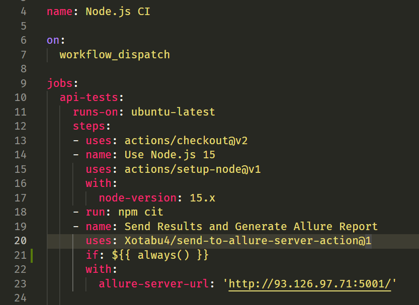

Allure Portal (Allure Report Server)
=================================


## About

https://allurereport.org/docs

Allure server for store / aggregate / manage Allure results and generate / manage Allure Reports.

There is simple API with Swagger(OpenAPI) Description.

Just use Spring Boot Jar from Release Page.

Web GUI has been available from Release v2.0.0

Example on [allure.iopump.ru](http://allure.iopump.ru/)

## Get Started

### Docker

There is a docker image on Docker Hub: [allure-server](https://hub.docker.com/r/kochetkovma/allure-server)
Running as Docker container look at: [readme](https://hub.docker.com/r/kochetkovma/allure-server)

### Kubernetes

Use Helm Chart for Kubernetes from **[.helm/allure-server/README.md](.helm/allure-server/README.md)**

### Jar

Get the latest release [Releases](https://github.com/kochetkov-ma/allure-server/releases)   
Download `allure-server.jar`  
Update your jre(jdk) up to [Java 11](https://www.oracle.com/java/technologies/javase/jdk11-archive-downloads.html)  
Execute command `java -jar allure-server.jar`

Got to `http://localhost:8080` - will redirect to OpenAPI (Swagger UI)

### Upload results or use [GitHub Actions](#github-actions)

Only allure2 supported  
Make some allure results and create `zip` archive with these results, for example `allure-results.zip` in your root dir

```shell
curl -X POST 'http://localhost:8080/api/result' \
-H  "accept: */*" \
-H  "Content-Type: multipart/form-data" \
-F "allureResults=@allure-results.zip;type=application/x-zip-compressed"
```

Response:

```
{
    "fileName": "allure-results.zip",
    "uuid": "1037f8be-68fb-4756-98b6-779637aa4670"
}
```

Save `uuid`  
Don't forget specify form item Content type as `application/zip`. Server works with `zip` archives only!

### Generate report

For generate new report execute `POST` request with `json` body:

```shell
curl --location --request POST 'http://localhost:8080/api/report' \
--header 'Content-Type: application/json' \
--data-raw '{
  "reportSpec": {
    "path": [
      "master",
      "666"
    ],
    "executorInfo": {
      "buildName": "#666"
    }
  },
  "results": [
    "1037f8be-68fb-4756-98b6-779637aa4670"
  ],
  "deleteResults": false
}'
```

Response:

```
{
    "uuid": "c994654d-6d6a-433c-b8e3-90c77d0e8163"
    "path": "master/666",
    "url": "http://localhost:8080/allure/reports/c994654d-6d6a-433c-b8e3-90c77d0e8163/",
    "latest": "http://localhost:8080/reports/master/666",
}
```

Memorize `url`

> :warning: **Generated Reports, and their History are grouping by `path` key. This key means something like `project` or `job` or `branch`. The latest report with the same `path` will be active**: It is not a real path - it's a logical path. The same situation with `path` column in GUI!

### Access to generated reports

After generating you can access the latest report by `http://localhost:8080/allure/reports/master/666/index.html`

You may get all reports

```shell
curl --location --request GET 'http://localhost:8080/api/report'
```

Or by path as branch name `master`

```shell
curl --location --request GET 'http://localhost:8080/api/report?path=master'
```

You may get all uploaded results:

```shell
curl --location --request GET 'http://localhost:8080/api/result'
```

You can clear all results or reports:

```shell
curl --location --request DELETE 'http://localhost:8080/api/result'
curl --location --request DELETE 'http://localhost:8080/api/report'
```

Or clear reports older than date (in epoch seconds):

```shell
curl --location --request DELETE 'http://localhost:8080/api/report?seconds=1604693740'
```

### Cleanup features (since 1.10.0)

Once per day the scheduler started and remove old reports with age better then `allure.clean.ageDays`.

Besides, if specified `allure.clean.paths` items with fields `path` and `ageDays`
all reports with path = `allure.clean.paths[].path` will be removed based on separate max age
from `allure.clean.paths[].ageDays`

**_Example:_**

```yaml
allure:
  clean:
    dryRun: false
    time: "00:00"
    ageDays: 90
    paths:
      - path: "manual_uploaded"
        ageDays: 30
      - path: "service/production-job"
        ageDays: 10
```

- Report with path=`test` and age=`100d` will be removed at today MIDNIGHT
- Report with path=`test` and age=`99d` will **NOT** be removed at today MIDNIGHT
- Report with path=`manual_uploaded` and age=`30d` will be removed at today MIDNIGHT
- Report with path=`manual_uploaded` and age=`29d` will **NOT** be removed at today MIDNIGHT
- Report with path=`service/production-job` and age=`10d` will be removed at today MIDNIGHT
- Report with path=`service/production-job` and age=`9d` will **NOT** be removed at today MIDNIGHT

### OAuth2 feature (since 2.12.0)
Separate Spring profile has been added `oauth`

To enable `Oauth` add this profile to `SPRING_PROFILES_ACTIVE` . For example:
- in `values.yaml` (Helm): 
```yaml
env:
    SPRING_PROFILES_ACTIVE: oauth
``` 
- shell command `export SPRING_PROFILES_ACTIVE=oauth`
- docker compose
```yaml
    environment:
      SPRING_PROFILES_ACTIVE: oauth
```

Now [application-oauth.yaml](src/main/resources/application-oauth.yaml) is adjusted to use Google Auth Server:
```yaml
### Internal Spring Configuration
spring:
  security:
    oauth2:
      client:
        registration:
          google:
            client-id: ${OAUTH2_GOOGLE_ALLURE_CLIENT_ID}
            client-secret: ${OAUTH2_GOOGLE_ALLURE_CLIENT_SECRET}
            scope: openid, profile, email
            redirect-uri: "{baseUrl}/login/oauth2/code/{registrationId}"
            client-name: Google
        provider:
          google:
            issuer-uri: https://accounts.google.com

### App OAuth2 Security Configuration Toggle
app:
  security:
    enable-oauth2: true
```
Pass your `OAUTH2_GOOGLE_ALLURE_CLIENT_ID` and `OAUTH2_GOOGLE_ALLURE_CLIENT_SECRET` or override configuration options to use other provider.

There is Oauth feature-toggle `app.security.enable-oauth2`

> Every spring boot setting can be passed through ENV variables with a little changes according to [spring boot cfg docs](https://docs.spring.io/spring-boot/docs/1.5.5.RELEASE/reference/html/boot-features-external-config.html)

**By default `oauth` profile is not used and disabled**

### Youtrack Integration (since 2.13.6) `new ⚡`

Enable in `application.yaml`
```yaml
tms:
  enabled: true # switched to true | Default: false
  host: youtrack.com # set youtrack HOST - NOT URL - Just hostname | Default: "" 
  api-base-url: https://${tms.host}/api # optional - set youtrack API URL or use default | | Default: https://${tms.host}/api
  token: "my-token" # set youtrack token generated in Profile | Default: ""
  issue-key-pattern: "[A-Za-z]+-\\d+" # optional - set issue key pattern | Default: "[A-Za-z]+-\\d+"
  dry-run: false # optional - dry run mode. Set true for testing and watch AllureServer Logs | Default: false
```

OR in `docker-compose.yaml`
```yaml
    environment:
      TMS_ENABLED: 'true'
      TMS_HOST: youtrack.com
      TMS_TOKEN: '<token-here>'
      TMS_DRYRUN: 'false'
```

- Add Link to TMS issue to yor scenario
```java
@Issue("KEY-666")
void test() {}
```

or
```java
@Link(value = "KEY-777", url = "https://youtrack.com/KEY-777")
void test() {}
```
- Generate Report
- Open Report in Browser
- Open scenario `test` go to link `KEY-666` and click on `KEY-666`
- In comments you will se statistics

  | **Scenario** | ❌ `Failed`                                 | ✅ `Passed`                                 |
  |--------------|--------------------------------------------|--------------------------------------------|
  | Scenario 1   | **2** times [`latest` on 01.01.2024](link) | **3** times [`latest` on 01.01.2024](link) |
  | Scenario 5    | **6** times [`latest` on 01.01.2023](link) | **7** times [`latest` on 01.01.2023](link) |

- this comment with statistics will be updated on every report generation
- your TOKEN should have permission: read issue comments, read/add/update issue comments  

### Custom Report Label/Logo and Title (since 2.13.6) `new ⚡`

Enable in `application.yaml`
```yaml
allure:
    title: "BrewCode | Allure Report"
    # FROM URL: https://avatars.githubusercontent.com/u/16944358?v=4
    # FROM FILE: file:/images/logo.png
    logo: "https://avatars.githubusercontent.com/u/16944358?v=4" # or file:/images/logo.png
```

OR in `docker-compose.yaml`
```yaml
    environment:
        ALLURE_LOGO: "https://avatars.githubusercontent.com/u/16944358?v=4"
        ALLURE_TITLE: "BrewCode | Allure Report"
```
> For using image from file you should put it into the container by volume
> 
> For using image from URL your should provide access to Company Network ot Internet from container

### Plugin System for Java Developers (since 2.13.6) `new ⚡` `beta`
Use `Java 21`
1. Create interface in your project in package `ru.iopump.qa.allure.helper.plugin`. It has to be exactly the same as in [AllureServerPlugin.java](src%2Fmain%2Fjava%2Fru%2Fiopump%2Fqa%2Fallure%2Fhelper%2Fplugin%2FAllureServerPlugin.java)
    ```java
    package ru.iopump.qa.allure.helper.plugin;
    
    import io.qameta.allure.core.LaunchResults;
    import org.springframework.beans.factory.BeanFactory;
    import ru.iopump.qa.allure.properties.AllureProperties;
    import ru.iopump.qa.allure.properties.TmsProperties;
    
    import java.nio.file.Path;
    import java.util.Collection;
    
    public interface AllureServerPlugin {
        void onGenerationStart(Collection<Path> resultsDirectories, Context context);
        void onGenerationFinish(Path reportDirectory, Collection<LaunchResults> launchResults, Context context);
        String getName();
        default boolean isEnabled(Context context) {
            return true;
        }
        interface Context {
            AllureProperties getAllureProperties();
            TmsProperties tmsProperties();
            BeanFactory beanFactory();
            String getReportUrl();
        }
    }
    ```
2. Crate your plugin like:
   - [CustomReportMetaPlugin.java](src%2Fmain%2Fjava%2Fru%2Fiopump%2Fqa%2Fallure%2Fhelper%2Fplugin%2FCustomReportMetaPlugin.java)
   - [YouTrackPlugin.java](src%2Fmain%2Fjava%2Fru%2Fiopump%2Fqa%2Fallure%2Fhelper%2Fplugin%2FYouTrackPlugin.java)
3. Create `FAT JAR` with all deps. Try to get rid of external deps if possible
4. Put your jar to container by volume to `/ext` folder
5. Run the server
6. Check logs. There is your plugin in message after plugins discovery and loading:
  ```
    [ALLURE SERVER CONFIGURATION] Allure server plugins loaded: [class ru.iopump.qa.allure.helper.plugin.CustomReportMetaPlugin:Logo Plugin, class ru.iopump.qa.allure.helper.plugin.YouTrackPlugin:YouTrack integration]
  ```

### Jira Integration (since 2.14.0) `coming soon`

### Plugin API in MavenCentral with proper Documentation (since 2.14.0) `coming soon`

### Custom HTTP Hooks (since 2.15.0) `coming soon`

### Special options

> Since version `1.2.0` all reports manage with Database and have unic uuids.

> Since version `1.10.0` there are new options for Cleanup,
> but also some old options have been renamed to integrate with the Spring Boot @ConfigurationProperties approach. And also the yaml format is used

Old format is no longer supported, but you can convert reports created before 1.2.0 - just set '
allure.support.old.format' to 'true' in Spring Configutaion:

- system vars (JVM option) `-Dallure.support.old.format=true`
- environment vars `export allure.support.old.format=true`
- in docker environment vars `-e allure.support.old.format=true`

**ENV**                      | **TYPE**                 | **DEFAULT**              | **DESCRIPTION**
------------------------------|--------------------------|--------------------------|----------------------------------------------------------------------------------------------------------------------------------------------------------
spring.datasource.url        | string                   | jdbc:h2:file:./allure/db | H2 jdbc connection string. By default DB file will be created/read on startup. Postgres driver supported!
PORT                         | int                      | 8080                     | Tomcat http port
allure.resultsDir            | string                   | allure/results/          | Unzipped results store
allure.reports.dir           | string                   | allure/reports/          | Generated results store
allure.reports.path          | string                   | reports/                 | Url path (after base url) to acccess to reports
allure.reports.history-level | int                      | 20                       | Number of reports in history
allure.support-old-format    | boolean                  | false                    | Auto-convert old format reports to new and add to db
JAVA_OPTS                    | string                   | -Xms256m -Xmx2048m       | Java memory options for container
allure.date-format           | string                   | yy/MM/dd HH:mm:ss        | Date Time format in grid
allure.server-base-url       | string                   |                          | Define custom base url for results. If your server behind the proxy or other troubles to get server external hostname. Don't forget about '/' at the end
basic.auth.enable            | boolean                  | false                    | Enable Basic Authentication
basic.auth.username          | string                   | admin                    | Username for basic auth
basic.auth.password          | string                   | admin                    | Password for basic auth
allure.clean.dryRun          | boolean                  | false                    | Don't delete but print logs. For testing
allure.clean.time            | LocalTime "HH[:mm][:ss]" | 00:00                    | Time to check reports age/ Scheduler start once per day
allure.clean.ageDays         | int                      | 90                       | Max age for all reports. But exclude specified paths in 'allure.clean.paths'
allure.clean.paths[].path    | String                   | manual_uploaded          | Report path
allure.clean.paths[].ageDays | int                      | 30                       | Max age for reports with this path

> Every spring boot setting can be passed through ENV variables with a little changes according to [spring boot cfg docs](https://docs.spring.io/spring-boot/docs/1.5.5.RELEASE/reference/html/boot-features-external-config.html)
> For example: `allure.report.host` transform to `ALLURE_REPORT_HOST`

> Postgres database supported!

> You can mount external jars to `/ext` folder in the container, and they will be available in app classpath.  
> For example you may add new jdbc drivers

```shell
    volumes:
      - ./ext:/ext:rw
```

### Docker compose

See docker compose:

[docker-compose with Postgres integration](./docker-compose.yml)

[docker-compose with default H2 database](./docker-compose-h2.yml)

Use Helm Chart for Kubernetes from **[.helm/allure-server/README.md](.helm/allure-server/README.md)**

### GitHub Actions

Thx [Xotabu4](https://github.com/Xotabu4)

There is external GitHub Action to sent and generate Allure
Reports: [send-to-allure-server-action](https://github.com/Xotabu4/send-to-allure-server-action)

```
Compresses allure-results, sends to kochetkov-ma/allure-server , and triggers allure report generation on it. Result of this action - is URL to generated report.

Works for any test project languages (java, .net, js/ts, python, etc), for any testing frameworks (junit, pytest, cucumber, mocha, jest ...) that has allure reporter configured.
```

Example:

```
    - name: Send Results and Generate Allure Report
      uses: Xotabu4/send-to-allure-server-action@1
      # always() needed because we want report for failed tests as well
      if: ${{ always() }}
      with:
        allure-server-url: 'http://my-allure-server.com:5001/'
```



### GUI

##### See example on [allure.iopump.ru](http://allure.iopump.ru/)

Allure Server provide WEB UI to access to reports and results.  
By default WEB UI is available on path `/ui` and there is redirection from `/` to `/ui`   
Example: `http://localhost:8080/ui`  
WEB UI provides the same functions as a REST API  
WEB UI is implemented with [Vaadin 14](https://vaadin.com/start/v14)

> :warning: **Generated Reports, and their History are grouping by `path` key. This key means something like `project` or `job` or `branch`. The latest report with the same `path` will be active**: It is not a real path - it's a logical path. The same situation with `path` column in GUI!

> *Main Page*
  

### Logging

Logging properties are located in `[application.yaml](src%2Fmain%2Fresources%2Fapplication.yaml)`

```
logging:
  level:
    root: INFO
    org.atmosphere: WARN # Vaadin (GUI) Server
    org.springframework: INFO
    org.springframework.core: WARN
    org.springframework.beans.factory.support: WARN
    ru.iopump.qa:allure: INFO # Allure Server Logs
```

You may override it by Environment Variables, for example enable `DEBUG` for allure server:
```
    export LOGGING_LEVEL_RU_IOPUMP_QA_ALLURE=DEBUG
```

Or switch all logs to `DEBUG`:
```
    export LOGGING_LEVEL_ROOT=DEBUG
```

## Goals
See [milestones](https://github.com/kochetkov-ma/allure-server/milestones)
